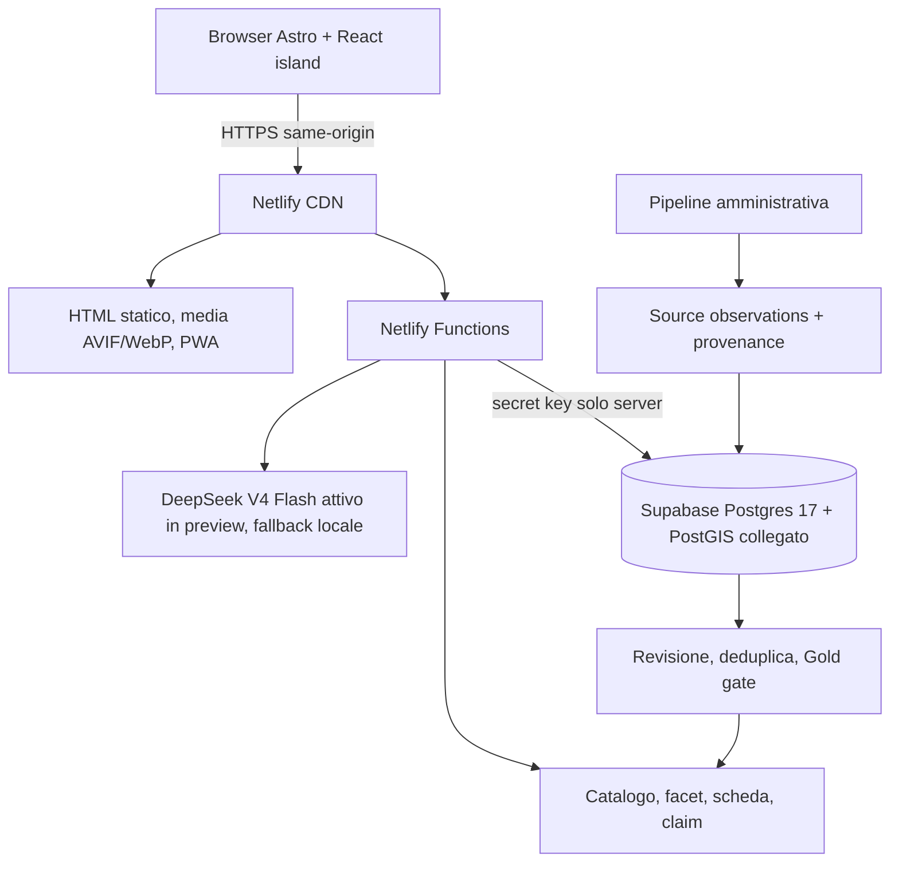

# TRE Milano — rapporto di production readiness

Data tecnica: 17 luglio 2026  
Stato: Supabase collegato, catalogo reale e interprete DeepSeek attivi nella preview Netlify; go-live indicizzabile/Gold subordinato agli interventi manuali elencati in fondo.  
Preview pubblica: <https://tre-milano-preview-160726.netlify.app/>

## 1. Risultato

La piattaforma conserva l’architettura static-first Astro/React e aggiunge un backend catalogo fail-closed, un modello Postgres/PostGIS versionato, una pipeline di acquisizione con provenance, API serverless, moderazione, privacy, claim e documentazione di esercizio. L’interfaccia è stata riallineata ai board TRE: podio 2–1–3 con corona trilobata, mappa sincronizzata, hero continua, immagine Duomo corretta e pagine editoriali più ricche.

La preview resta deliberatamente `noindex`, `PUBLIC_SITE_MODE=preview` e `PUBLIC_DATA_MODE=fixture`, ma la discovery interroga il catalogo remoto realmente collegato: 6 locali Gold/Platinum verificati sono disponibili tramite API, ricerca, podio, mappa e scheda. Le pagine demo residue restano identificate come fixture; non sostituiscono silenziosamente un errore del database.

## 2. Architettura consegnata

- Astro produce 42 pagine HTML e metadata SEO/GEO statici.
- React idrata soltanto ricerca, podio, mappa, preferiti, profilo e sessione gruppo.
- Sei Functions Netlify implementano API catalogo, facet, dettaglio, claim, manutenzione e interpretazione DeepSeek.
- Il browser non possiede chiavi Supabase e non accede direttamente a PostgREST.
- La ricerca ibrida usa DeepSeek esclusivamente per convertire query ambigue in un contratto strutturato; vincoli, sicurezza e Top 3 restano deterministici.
- Il progetto Supabase remoto è collegato; tutte le 8 migrazioni locali risultano applicate e allineate alla history remota.

## 3. Database e migrazioni

Migrazioni versionate applicate al progetto remoto:

1. `20260716215041_catalog_core.sql`: estensioni, catalogo, geografia, provenance, editoriale, moderazione e operations;
2. `20260716215042_catalog_api_security.sql`: ricerca RPC, facet, dettaglio, claim, rate limit, grant e RLS;
3. `20260716215043_catalog_ingestion_operations.sql`: staging/import, deduplica, retry, retention e maintenance;
4. `20260717091500_catalog_hardening.sql`: vincoli e boundary privilegiati aggiuntivi;
5. `20260717091933_official_catalog_review_workflow.sql`: revisione esplicita dei fatti provenienti da fonti ufficiali;
6. `20260717092705_enable_milano_open_data_observations.sql`: acquisizione delle fonti comunali nel solo livello privato;
7. `20260717094502_register_owned_editorial_venue_visuals.sql`: manifest e provenance dei visual editoriali di proprietà del progetto;
8. `20260717115524_preserve_reviewed_osm_geocoding_provenance.sql`: conservazione della geocodifica OSM revisionata, senza abilitare crawling schedulato.

Il modello comprende 32 tabelle nelle seguenti aree:

| Area | Entità principali |
|---|---|
| Catalogo | locali, categorie, sottocategorie, contatti, prezzi, servizi, immagini e diritti |
| Geografia | municipi, NIL/quartieri, indirizzi, `geography(Point, 4326)` e indici GiST |
| Orari | ricorrenze settimanali, eccezioni e freschezza |
| Provenance | fonti, record, osservazioni, fonte per campo e cronologia |
| Trust | rating distinti per fonte, qualità/completamento, duplicati candidati |
| Editoriale | ranking, podi, guide e relative entry versionate |
| Moderazione | segnalazioni, claim, verifica, revisore e retention |
| Operations | import run, errori, coda retry e rate limit atomico |

La ricerca combina FTS italiano, trigrammi, raggio, bounding box, quartiere, servizi, prezzo, rating e qualità; supporta ordinamento e paginazione keyset. RLS è abilitata e forzata su tutte le tabelle; `anon` e `authenticated` non hanno grant diretti e le RPC sono service-role-only.

Dettaglio: [DATA_ARCHITECTURE.md](./DATA_ARCHITECTURE.md).

## 4. Fonti e pipeline

Le fonti comunali sono abilitate esclusivamente per l'acquisizione privata; pubblicazione e ranking restano subordinati alla revisione editoriale:

| Fonte | Volume grezzo | Stato remoto verificato |
|---|---:|---|
| Comune di Milano DS58 — pubblici esercizi in piano | 9.417 | 9.204 osservazioni amministrative private accettate |
| Comune di Milano DS59 — pubblici esercizi fuori piano | 3.671 | 3.396 osservazioni amministrative private accettate |
| Comune di Milano DS250 — attività economiche alimentari | 1.594 | 1.568 osservazioni amministrative private accettate |
| OpenStreetMap/Nominatim | variabile | 6 geocodifiche selezionate e revisionate; `api_url=null`, nessun crawl schedulato |
| Siti ufficiali dei locali | manuale | 6 locali reali verificati, 18 source record e 48 provenance di campo selezionate |

Le 14.682 righe comunali sono snapshot amministrativi al 31 dicembre 2023: non dimostrano che un esercizio sia attualmente aperto e non generano automaticamente una venue pubblica. Il checkpoint remoto conserva 14.168 osservazioni private accettate e 2 errori espliciti; nessuna osservazione comunale è stata promossa automaticamente a locale pubblico. Il catalogo contiene 6 venue reali, attive, verificate e idonee alle raccomandazioni: 5 Gold e 1 Platinum. La pipeline ha dry-run, conferma doppia di scrittura, checksum/idempotenza, normalizzazione, validazione, retry, error ledger, candidate duplicate e revisione manuale. Geocodifica massiva tramite Nominatim pubblico resta esclusa.

Dettaglio: [DATA_PIPELINE.md](./DATA_PIPELINE.md) e [SOURCE_POLICY.md](./SOURCE_POLICY.md).

## 5. Environment variables

I template completi sono [`.env.example`](../.env.example), [`.env.production`](../.env.production) e [`.env.pipeline.example`](../.env.pipeline.example). Nessuno contiene valori reali; il template pipeline non va importato su Netlify.

Minimo per attivare il catalogo e la ricerca remota nella configurazione Netlify production di questo progetto:

- pubbliche/build: `PUBLIC_SITE_URL`, `PUBLIC_SITE_MODE`, `PUBLIC_DATA_MODE`;
- server-only: `SUPABASE_URL`, `SUPABASE_SECRET_KEY`, `RATE_LIMIT_HASH_SECRET`, `DEEPSEEK_API_KEY`;
- soltanto al futuro cutover della claim API: `PUBLIC_TURNSTILE_SITE_KEY`, `TURNSTILE_SECRET_KEY`, con `TURNSTILE_EXPECTED_HOSTNAME` opzionale;
- solo pipeline/CI: `SUPABASE_ACCESS_TOKEN`, `SUPABASE_PROJECT_ID`, `SUPABASE_DB_URL`, `DATA_IMPORT_*`.

Turnstile è obbligatorio soltanto nel futuro cutover dalla Netlify Form pubblica alla claim API: widget, CSP, informativa e test vanno attivati insieme. Il build Gold richiede ora una `PUBLIC_SITE_URL` esplicita e non accetta il fallback del deploy; i comandi dati preferiscono `.env.pipeline` con fallback `.env`.

`DEEPSEEK_API_KEY` si inserisce in **Netlify → Project configuration → Environment variables**, senza prefisso `PUBLIC_`. Il runtime conserva un fallback deterministico se la chiave manca o il provider non risponde, ma lo script di sincronizzazione production la richiede perché l'interprete remoto fa parte del perimetro concordato. La stessa regola server-only vale per tutte le chiavi private. La tabella completa con obbligatorietà, scope e rotazione è in [ENVIRONMENT_VARIABLES.md](./ENVIRONMENT_VARIABLES.md).

Al momento di questo aggiornamento, Netlify contiene nel contesto production le variabili Supabase, rate-limit, cache, modalità pubbliche e DeepSeek necessarie. `SUPABASE_SECRET_KEY`, `RATE_LIMIT_HASH_SECRET` e `DEEPSEEK_API_KEY` sono marcate secret e non includono lo scope post-processing. Turnstile, i webhook di claim/alert e IndexNow restano intenzionalmente assenti: il modulo pubblico usa Netlify Forms, non vengono inviate notifiche esterne e la preview rimane non indicizzabile.

## 6. API, sicurezza e operations

| Endpoint | Controlli principali |
|---|---|
| `GET /api/catalog` | allow-list filtri, keyset, rate limit, timeout, cache privata per query/geo |
| `GET /api/catalog/facets` | input minimo, RPC service-only, cache pubblica breve |
| `GET /api/venues/:slug` | slug stretto, 404/503 distinti, ETag sicuro |
| `POST /api/venue-claims` | same-origin, body limit, Turnstile hostname/action, doppio rate limit, PII minimizzata |
| `POST /api/search/interpret` | same-origin, privacy guard, JSON schema, timeout e fallback deterministico |
| maintenance schedulata | stale gate, retention, import queue e alert minimizzati |

Sono stati aggiunti timeout estesi alla lettura dei body, `Retry-After`, errori sanitizzati, validazione canonica dell’URL Supabase, redirect bloccati, limiti anti-esaurimento, gestione distinta delle chiavi `sb_secret_*` e JWT legacy, cache `private, no-store` per query/coordinate e una doppia conferma per ogni import in scrittura.

Backup consigliato: database giornaliero, PITR secondo RPO/RTO, inventario/checksum e copia separata degli originali media. Il restore va provato trimestralmente su un progetto reale.

## 7. UI/UX e contenuto

- tassonomia quartieri unificata in `src/domain/neighborhoods.ts` (22 zone con alias colloquiali quali Montenapoleone, corso Como, Chinatown, colonne di San Lorenzo) condivisa da parser locale, contratto DeepSeek, snapshot podio e selettore zona; copre anche le zone del catalogo reale Porta Venezia, Monumentale e Quadrilatero della moda;
- hero con gradiente multilivello più naturale su desktop e mobile;
- immagine Duomo sostituita con un asset originale generato per il progetto, ottimizzato in JPG/WebP/AVIF e dichiarato rappresentativo;
- card podio con sagoma trilobata, gerarchia editoriale, spesa, tempo, freschezza, confidenza, trade-off e CTA;
- mappa editoriale alimentata dal catalogo remoto quando disponibile, marker numerati accessibili, collision fan-out, zoom, anteprima e sincronizzazione card ↔ mappa;
- pagine Quartieri, Guida e Metodo con breadcrumb, statistiche, callout, collezioni, navigazione interna e layout dedicati;
- sidebar sticky non invasiva, scrollspy e drawer mobile;
- footer riordinato con claim, correzioni, privacy, cookie e termini.

## 8. SEO, GEO e performance

- canonical, Open Graph/Twitter e JSON-LD serializzato in sicurezza;
- author/reviewer, breadcrumb, FAQ e pagine entity;
- sitemap segmentate e IndexNow soltanto dopo gate Gold;
- `robots.txt`, meta e `X-Robots-Tag` obbligatori in preview; il noindex globale viene omesso automaticamente soltanto da una build `production/gold` validata;
- 28 varianti responsive AVIF/WebP, nessun upscale e manifest con hash;
- API e URL con query escluse dalla cache PWA;
- bundle client verificato a circa 113 KB gzip.

Il go-live indicizzabile richiede contemporaneamente dominio HTTPS definitivo, `PUBLIC_SITE_MODE=production`, `PUBLIC_DATA_MODE=gold`, catalogo autorizzato e approvazione legale.

## 9. Legale, privacy e claim

Sono predisposte bozze professionali, esplicitamente non equivalenti a parere legale:

- `/privacy/`, `/cookie-policy/`, `/termini/`, `/informativa-dati/`;
- `/correzioni/` per segnalazioni fattuali;
- `/rivendica-scheda/` per claim, aggiornamento, rimozione e diritti media;
- procedure interne, basi giuridiche proposte, retention, fornitori, trasferimenti, DSA, reclami e data breach.

Il modulo pubblico usa per ora Netlify Forms. L’API Supabase/Turnstile è pronta ma il cutover UI deve avvenire insieme a CSP, widget e informativa aggiornati. L'interprete DeepSeek è tecnicamente attivo nella preview `noindex` per le sole query complesse e il codice non registra intenzionalmente il testo delle query; ciò non chiude il gate legale. Titolare, contatti, DPA/TIA, trasferimento internazionale, retention effettive e testi finali richiedono approvazione di un legale o consulente privacy prima di promozione e indicizzazione.

Dettaglio: [LEGAL_DRAFTS.md](./LEGAL_DRAFTS.md).

## 10. Verifiche eseguite

| Gate | Esito |
|---|---|
| `pnpm lint` | Biome, 106 file verificati, 0 violazioni |
| `pnpm check` | 143 file, 0 errori, warning o hint |
| `pnpm test` | 237 test Vitest + 32 test Node superati |
| `pnpm build` | 42 pagine, circa 113 KB JS gzip, 0 errori |
| Playwright | 75 casi: 71 superati e 4 skip intenzionali, a 360, 768 e 1440 px |
| axe | nessuna violazione critical/serious nei flussi testati |
| Lighthouse | Performance 100, Accessibility 100, Best Practices 100, SEO 100 |
| media audit | 5 sorgenti, 28 varianti, nessun upscale |
| Netlify Functions bundle | 6 funzioni previste, nessun test incluso |
| `pnpm audit --prod --audit-level=low` | 0 vulnerabilità note |
| Supabase | 8 migrazioni locali/remoto allineate; advisor di sicurezza e performance senza warning/error |

La scansione finale dei file versionabili e del build non ha rilevato valori segreti o nomi di credenziali server-only nel bundle browser. I file locali contenenti credenziali restano esclusi da `.gitignore`; il workspace non è però inizializzato come repository Git, quindi non esiste una history da verificare.

Deploy Netlify finale verificato: `6a5a07884098dd0090c22dea`, URL stabile <https://tre-milano-preview-160726.netlify.app/>. Gli smoke live confermano header CSP/HSTS/noindex, 6 venue Gold/Platinum dal catalogo remoto, facet e schede reali, ETag/`304`, cache, errori `400`/`404`, `200` same-origin e `403` cross-origin. Le query complesse confermano `source: "deepseek"` e modello configurato `deepseek-v4-flash`; le query già comprese dal parser locale evitano la chiamata al provider.

## 11. Limiti e interventi manuali

1. Ruotare le chiavi Supabase e DeepSeek esposte durante la sessione operativa, aggiornare Netlify e la pipeline e ridistribuire. La service-role legacy locale non è usata dal runtime Netlify e va rimossa dal file locale dopo la rotazione.
2. Approvare privacy, cookie, termini, titolare, DPA, TIA, trasferimento e retention DeepSeek. La preview `noindex` è tecnicamente funzionante, ma non costituisce approvazione legale al go-live.
3. Il catalogo pubblico iniziale contiene 6 locali verificati. Le 14.168 osservazioni comunali restano private e richiedono deduplica, verifica di apertura, diritti media e promozione editoriale record per record.
4. Il maintenance giornaliero accoda le fonti dovute ma non esiste ancora un worker autonomo che consumi la coda: gli aggiornamenti ufficiali e comunali vanno lanciati con i comandi documentati.
5. Turnstile, claim API pubblica, webhook di claim/alert e IndexNow sono intenzionalmente inattivi. Il flusso pubblico usa Netlify Forms; ogni cutover richiede configurazione e test coordinati.
6. Configurare dominio definitivo, titolare/contatti reali, backup/PITR coerenti con il piano e una prova di restore; quindi rieseguire i gate prima di passare a `production/gold` e rimuovere il `noindex`.
7. Le chiamate DeepSeek osservate in produzione hanno richiesto circa 1,4–2,8 secondi end-to-end; l'upstream è limitato a 2,4 secondi e oltre tale soglia il client mostra subito il fallback. I percorsi locali/privacy guard restano nell'ordine di 0,2–0,3 secondi. Monitorare latenza, timeout, quota e costo nel pannello provider e nelle metriche Functions.
8. Il refetch strutturato dei candidati è limitato a 50 record e non implementa ancora paginazione successiva; con la crescita del catalogo andrà esteso senza inviare la query libera al catalogo.
9. Il repository Git è inizializzato e collegato a `github.com/Massimilianociconte/tre-milano` (deploy Netlify da push). Branch protection e regole di review sul remoto restano da configurare manualmente.

Le dipendenze transitive obsolete di `@lhci/cli` sono state vincolate alle release corrette di `tmp` e `uuid` nel workspace; Lighthouse è rieseguito come test di compatibilità dopo l’override.
